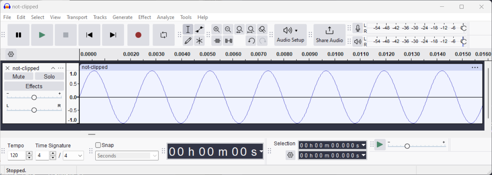
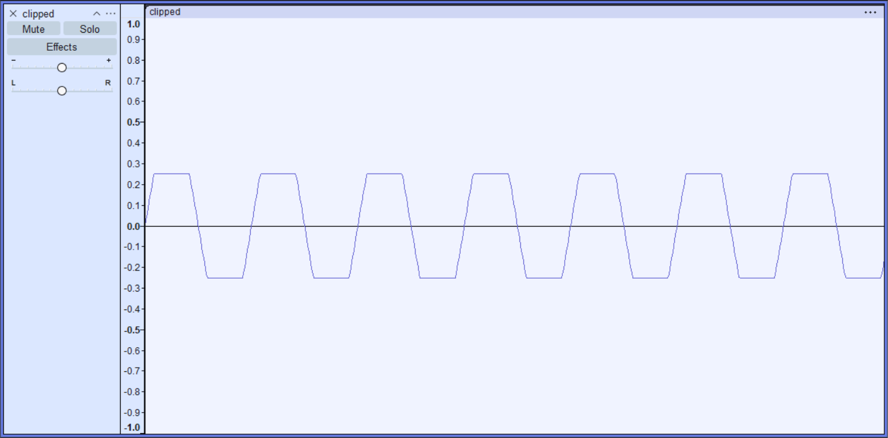

# HW1 - Clipped
- Setup using a Jupyter notebook.
- Installed scipy, sounddevice, and libportaudio2.
- set timespace variable t.
  - from 0 to 1.
  - number of samples to generate (sample rate * frequency).
- use that to generate a sine wave from -1 to 1 using floats.
- Convert to 16 bit signed ints (`sine16 = np.int16(sine_wave * max16)`).
- Write to `not-clipped.wav` using `scipy.io.wavfile.write`.
- Here is a screenshot of what the `non-clipped.wav` looks like:

- Using `numpy.clip(sine16//2, -8192, 8192)` you can quickly create a 
clipped version. That looks like this and matches the assignment:

- Saved this file as `clipped.wav` and the notebook will automatically playback 
the audio using the python library `sounddevice`.
- If need be, I can make this into a quick and simple python script, but I
am using a python `venv` and Jupyter notebook with a `requirements.txt`.
- This assignment is complete to the specs laid out. There's no further work for me to do, but it does give me some ideas to play with when it comes to generating all kinds of sounds.
  - I wonder, is this easier than using tools to get what I want? Just raw creation vs tweaking and adjusting things I know nothing about a la music editing software...?