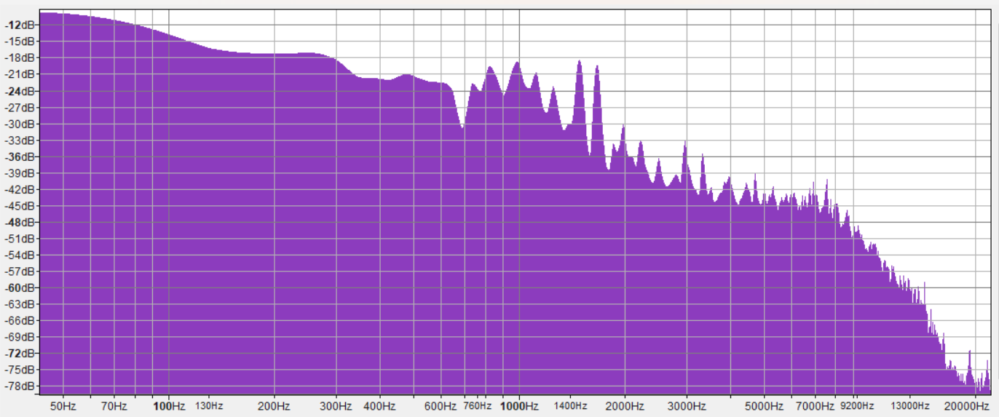
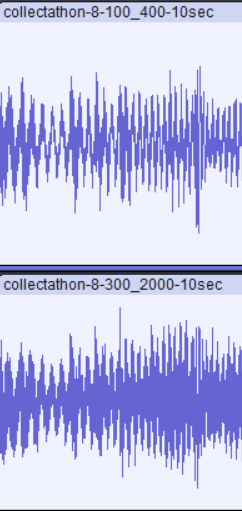
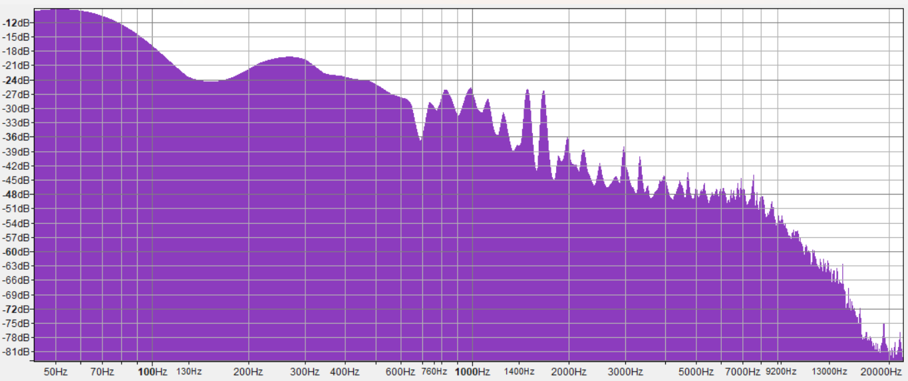
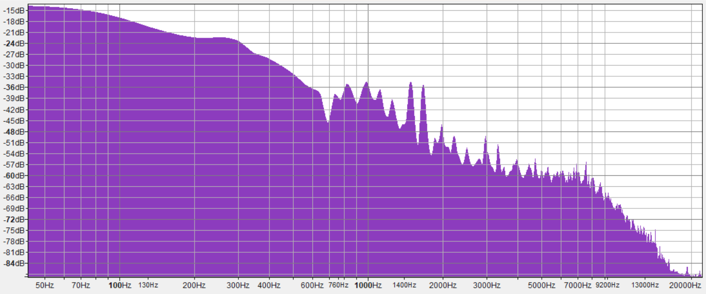
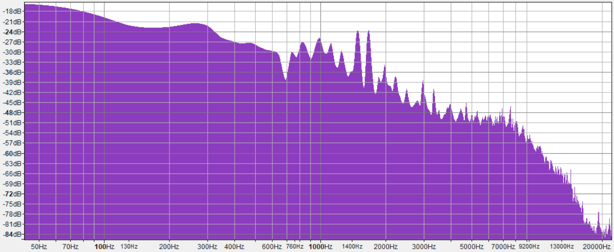
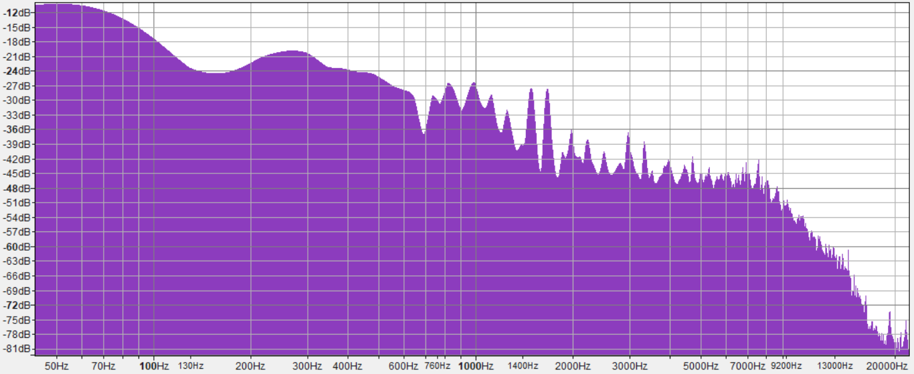
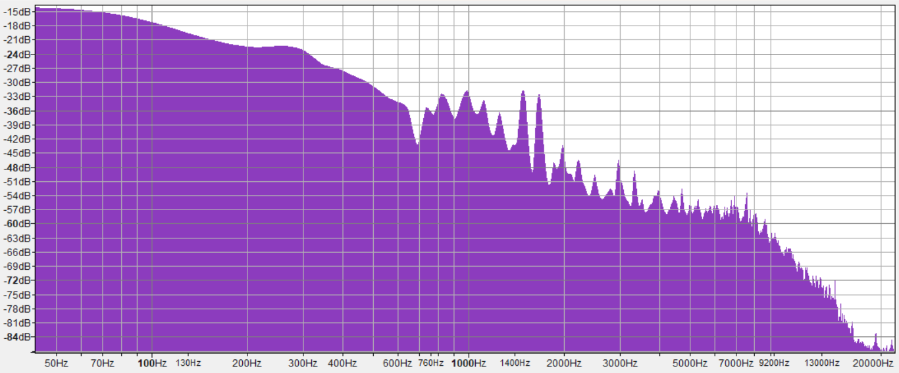
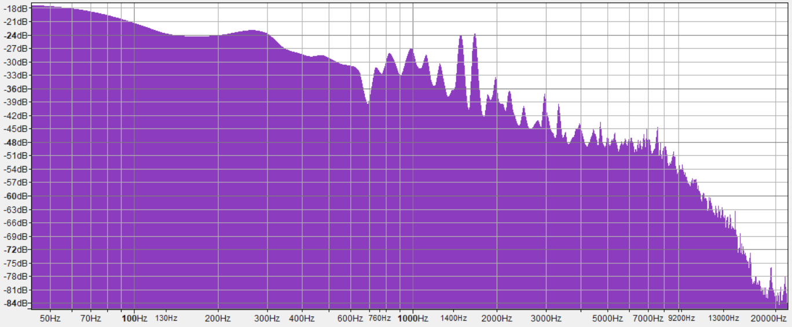
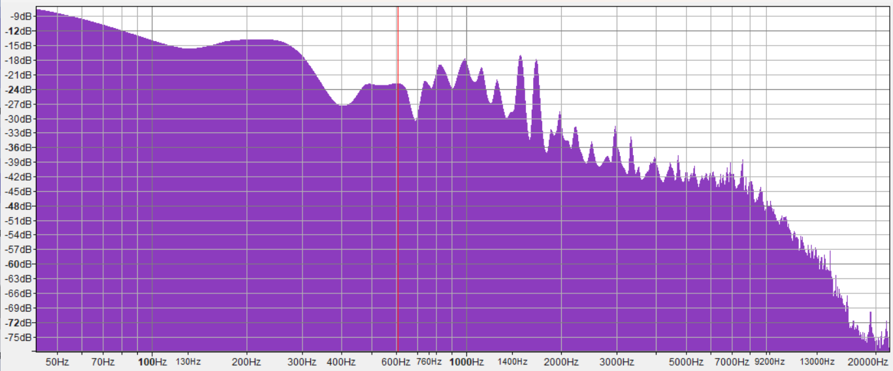

# Table of Contents
- [Table of Contents](#table-of-contents)
- [HW2 - Adaptive Tone Control](#hw2---adaptive-tone-control)
- [Why so many files?](#why-so-many-files)
- [Original Spectrum](#original-spectrum)
- [Naming convention of files.](#naming-convention-of-files)
- [Observations:](#observations)
  - [1 - Collectathon-8-100\_400 + collectathon-8-300\_2000](#1---collectathon-8-100_400--collectathon-8-300_2000)
  - [2 - Collectathon-16-100\_400 + Collectathon-16-300\_2000](#2---collectathon-16-100_400--collectathon-16-300_2000)
  - [3 - Even better?](#3---even-better)
- [Conclusion](#conclusion)
- [Wait. What about all the other files you generated?](#wait-what-about-all-the-other-files-you-generated)

# HW2 - Adaptive Tone Control
- Retrieved the file, set it to mono
- Adapt code I did with Bart to suit my needs
- Created filters to use and applied to each
- The way I elected to play with the FFT and filters
is by adjusting the band ranges across block sizes from 2
all the way up 4096.
  - This produced a wide range of 10 sec cuts of the `collectathon.wav` found in `hw2assets`.

# Why so many files?
This allowed me to play with it in a large number of ways. What I 
started doing was loading them into audacity and playing with the 
mix/combo of a variety of tracks by muting some and just listening to them. Then comparing against the original tracks first 10 seconds.

# Original Spectrum
Here is an image to compare against as you go through this readme and see the 
various spectrums analyzed.

# Naming convention of files.
I'll be posting some screenshots with file names from audacity so you can better understand the way these are named:

`original_name_of_file-block_size-band_ranges-length.wav`

# Observations:
## 1 - Collectathon-8-100_400 + collectathon-8-300_2000

This one sounds almost as good as the original. What has happened 
in all of these (I suspect because of going from stereo to mono) is 
that a lot of the echo and reverb is lost in the track, but it retains a lot 
of the bass and treble.

Those heavier sounds are heavier, which makes sense since a lot of 
focus is on the lower bands given the full range. Here is what they look like 
analyzed together:

When compared against the original, you can see that everything is increased,
but the lows have more energy output based in dB than the original does. While, 
yes, combining the two will obviously amplify it quite a bit, here are the 
two analyzed individually.

block of 8 with 100 - 400 bands:

block of 8 with 300 - 2000 bands:

Based on observation, the lows, again, clearly have more presence than the mids 
or highs do. Which is expected.

## 2 - Collectathon-16-100_400 + Collectathon-16-300_2000
Skipping over the waveforms lets look at the spectrums combined.

This combination sounds incredibly good. I actually think I prefer it 
to the original because it has more kick in it's lows, and the highs are 
there but they've lost their fidelity. It's unfortunate, because I think 
if I taken the time to just find the highs that sounded just right, I 
think this combination of tracks could be really good.

However, the reverb and echo is lost which also adds a lot of personality. 
I suspect the FFT could be adjusted slightly (parameter wise) to get those
missing highs, but not the reverb and echo. 

Here are the two analysis independent of each other:

block of 16 with 100 - 400 bands:

block of 16 with 300 - 2000 bands:

## 3 - Even better?
Though, what's even more interesting is I can take the 16-100_400 and 
combine it to get this analysis:

Which might not look like much but those lows being added back in 
[actually did wonders for it here! Listen!](./hw2assets/collecta2.mp3)

# Conclusion
Give the facts presented in section 3, in some definition, is why we use FFT
filters. Being selective of the ranges and sizes can improve a song with enough
attention to detail, you get some really fantastic sounds. Again, art is 
subjective, and my personal bias is telling me that just a little more kick in 
the lows really makes this song pop!

# Wait. What about all the other files you generated?
They all sound pretty close to the original, or weren't super interesting to me 
when playing with them. Though, in all of them, that echo and reverb is
seemingly lost OR has significantly reduced fidelity.