# Table of Contents
- [Table of Contents](#table-of-contents)
- [Python Version](#python-version)
    - [**This project absolutely requires Python 3.10 or newer!**](#this-project-absolutely-requires-python-310-or-newer)
- [About This Project](#about-this-project)
- [How to Run](#how-to-run)
- [Writeup - Experience, Lessons Learned, Future Work](#writeup---experience-lessons-learned-future-work)
  - [Experience](#experience)
    - [Standing Wave](#standing-wave)
    - [Interactive](#interactive)
      - [E2 Graph and Success Text:](#e2-graph-and-success-text)
      - [A2 Graph and Success Text:](#a2-graph-and-success-text)
      - [D3 Graph and Success Text:](#d3-graph-and-success-text)
      - [G3 Graph and Success Text:](#g3-graph-and-success-text)
      - [B3 Graph and Success Text:](#b3-graph-and-success-text)
      - [E4 Graph and Success Text:](#e4-graph-and-success-text)


# Python Version
### **This project absolutely requires Python 3.10 or newer!**

# About This Project
This project is 2 different types of guitar tuners.
1. Standing wave - listen to the generated tone and play the relevant string
2. Interactive - use a microphone plugged into your computer to do a short
recording to automatically detect how close it is to the note picked.


# How to Run
Before running highly recommend creating a python virtual environment.
After that, start the virtual env, then install `requirements.txt` like so:
```BASH
(.venv).../$ pip install -r requirements.txt
```

From here you can run the script with the following:

`python tuner.py` - On Windows

`python3 tuner.py` - On *most* POSIX like (Mac, Linux) based systems.

To see the usage run `python tuner.py -h` for all the relevant and command line
options.

Here are some example executions though to help:
1. `python tuner.py -ld` - lists the devices available to record with on the machine.
required and useful for the interactive mode.
2. `python tuner.py -m sw -n D3` - plays a standing wave tone for the D3 note
3. `python tuner.py -m ia -d 1 -n D3` - uses interactive mode, will use device 1 
(listed from example 1, yours will be different), and will inspect and measure 
for note D3 frequency (146.83Hz).

From here, you're able to play with it on your own!

# Writeup - Experience, Lessons Learned, Future Work

## Experience
This was a lot harder and more involved that I thought it would be. When I asked
Bart about doing this project he said:
> "Sure just make it fancy!"

Which left me with a major question mark of "How do you make a fancy tuner?" 
I decided that making a tuner that was multi-modal would be pretty neat. Turns 
out that was the right way to go.

The three I wanted to (axed the last one) were...
1. **Standing Wave** - simply listen and play the same note on the instrument and 
tune accordingly
2. **Interactive** - provided a note and a recording device, do a short recording of
the note on the instrument and see how close they are by comparing the fundamental
frequency to the actual frequency and letting the user know how close they are.
3. **Automatic** (not done, removed due to Bart saying don't sweat it) - Provided 
a recording device, the user can play a note and the script will automatically 
detect which note was played, and how far off it was from the frequency that 
note is normally. No input or menu selection from the user required, runs 
constantly until the user stops.

### Standing Wave
I started with the standing wave version to get my feet wet. This was simple 
enough and worked out really well. When I started working on the project, this 
version had issues of a pop in the audio loop, asking Bart he said I would need 
to do enveloping, and that we hadn't learned that yet. Eventually I taught 
myself how to do it.

In the `apply_fade` function, using fractional sizing, that then is applied to 
the multiplicative for both the fade in and fade out sections of the wave being 
generated. This both starts and stops at absolute 0 because of the setup.

```python
if note.size < 2 * fade_samples:
    half = note.size // 2
    fade_in = np.linspace(0, 1, half)
    fade_out = np.linspace(1, 0, half)
else:
    fade_in = global_fade_in
    fade_out = global_fade_out
note[: fade_in.size] *= fade_in
note[-fade_out.size :] *= fade_out
return note
```

The note wave is generated before this step, this is the last step before it's 
played out to the systems default output device (sounddevice does this by 
default.)

That's really the extent of the work I had to do, and didn't take most of my 
time overall in the project. That's reserved for the next two sections.

### Interactive
This was revisited several times and ultimately the final step of the project 
for reasons previously mentioned. This will probably be the largest section too,
so strap in!

I had found several articles online discussing how best to approach this 
situation and all of them involved using FFTs to some degree. I *thought* I had 
a working version with this bit of code:

```python
fft_res = np.fft.fft((self.recAudio()))
magnitude = np.abs(fft_res)
freqs = np.fft.fftfreq(fft_res.size, 1 / SAMPLE_RATE)
positive_mask = freqs > 0
dom_freq_idx = np.argmax(magnitude[positive_mask])
if test_freq == 82.41 or test_freq == 329.63:
    dom_freq = (freqs[positive_mask][dom_freq_idx]) / 2
else:
    dom_freq = freqs[positive_mask][dom_freq_idx]
```

If you're familiar with this sort of thing, you can very quickly tell this is 
very wrong. The resources I was looking at lead me very astray. This was looking
for a dominant frequency based on the strongest magnitude. In a perfectly quiet 
room with a standing wave tone being generated, this would probably be fine. 

However, this doesn't work very well when you try it in any other scenario. 
If any other frequency is louder than the one you're testing for, then the 
dominant frequency is *way* off - too high or too low - and so anything with 
magnitude larger than the note your plucking on your guitar (including the 
harmonics!!!!) will take precedence and give horribly inaccurate comparison.

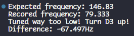

Clearly, this is horribly incorrect! Keen observers would note that this doesn't
make sense for D3, but imagine the numbers flipped. Say we were tuning for E2, 
and got ~146Hz for the recorded frequency... Well, that means the harmonics of 
E2 got picked up and not the **fundamental frequency** - the first peak with the 
most prominence in a chain of peaks - but rather some other peak in the recording.

So, how did I fix this? Thankfully, it's been solved by people way smarter than I.
With `scipy.signal.find_peaks()` we can provide classification of *which* peaks 
we want, and collect those. This isn't an exact science, but it is significantly
better than what I was working with before. As of the most current commit to the
code, it now looks like this:

```python
test_freq = NOTES_TO_FREQ_DICT.get(self.note)
fft_res = np.fft.fft(self.recAudio())
magnitude = np.abs(fft_res)
freqs = np.fft.fftfreq(fft_res.size, 1 / SAMPLE_RATE)
range_mask = (freqs > 50.0) & (freqs < 400.0)
filtered_freqs = freqs[range_mask]
filtered_magnitude = magnitude[range_mask]

# Where the magic happens
peaks, _ = signal.find_peaks(
    x=filtered_magnitude,
    height=100,  # Minimum peak height
    distance=200,  # Minimum distance between peaks
    prominence=100,  # Minimum prominence of peaks
)
# This returns a python list of peaks it found meeting these minimum
# characteristics.

# set some defaults for the next step
fund_freq_idx = 0

# None used if no peaks found (no significant audio detected)
fund_freq = None
if len(peaks) > 0:
    fund_freq_idx = peaks[0]
    fund_freq = filtered_freqs[fund_freq_idx]
```

Once this is established, it is reliably accurate! Some notes (G3 and B3) can be 
problematic still sometimes, but still does a good measurement with a good 
recording.

The following images are pretty self explanatory, and will have minimal 
analysis for each image. The images themselves are the detected peaks and some 
additional information regarding their power/strength. This peak info starts 
from peak[0] since that is how the information was generated by `find_peaks()`.

___
#### E2 Graph and Success Text:
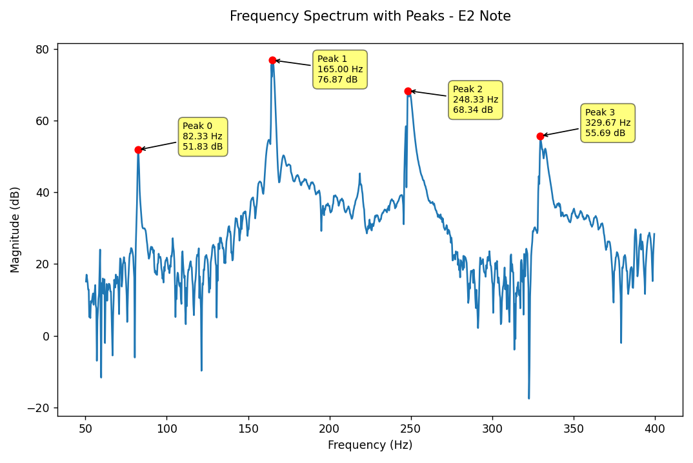
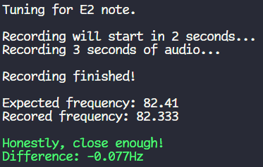
___

#### A2 Graph and Success Text:
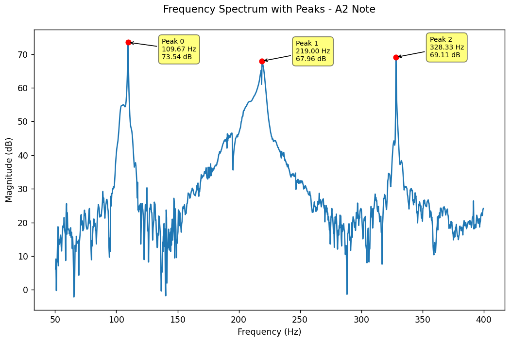
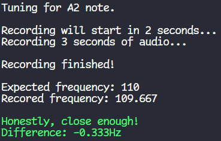
___

#### D3 Graph and Success Text:
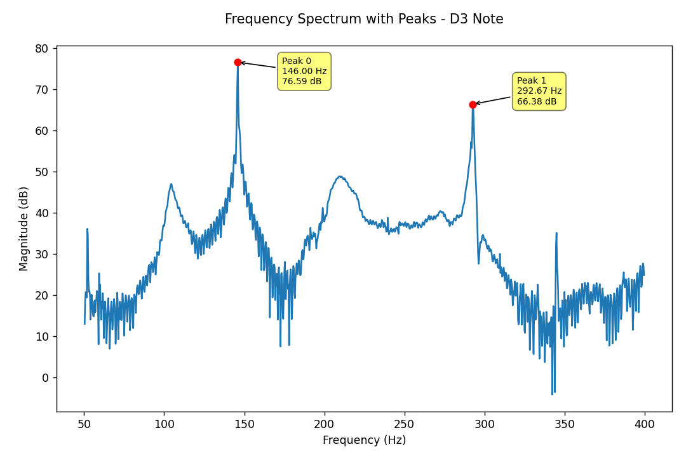
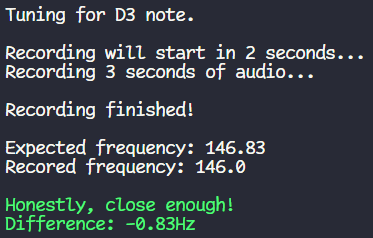
___

#### G3 Graph and Success Text:
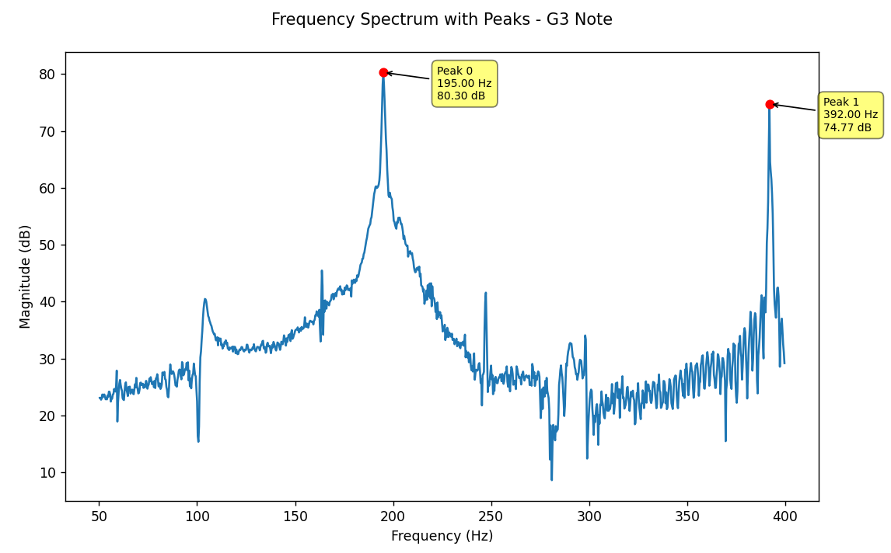
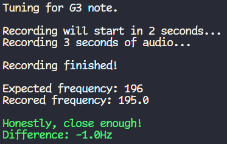
___

#### B3 Graph and Success Text:
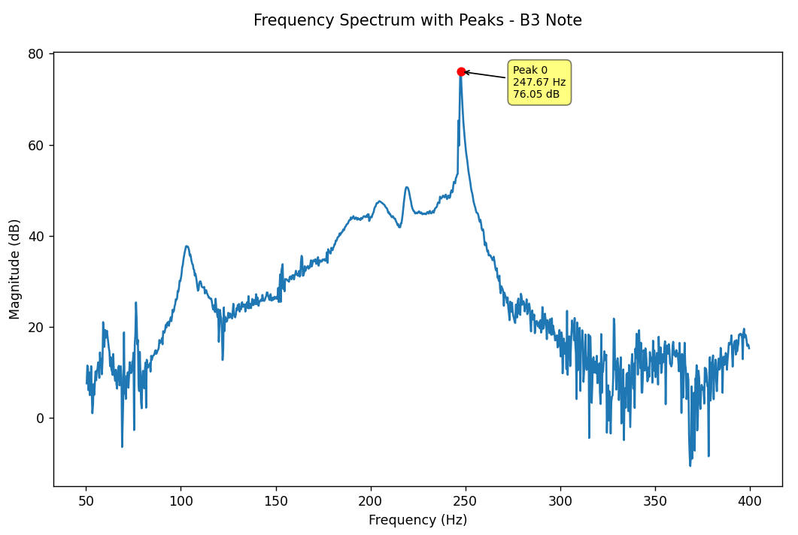
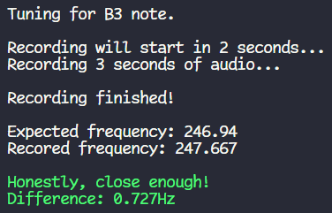
___

#### E4 Graph and Success Text:
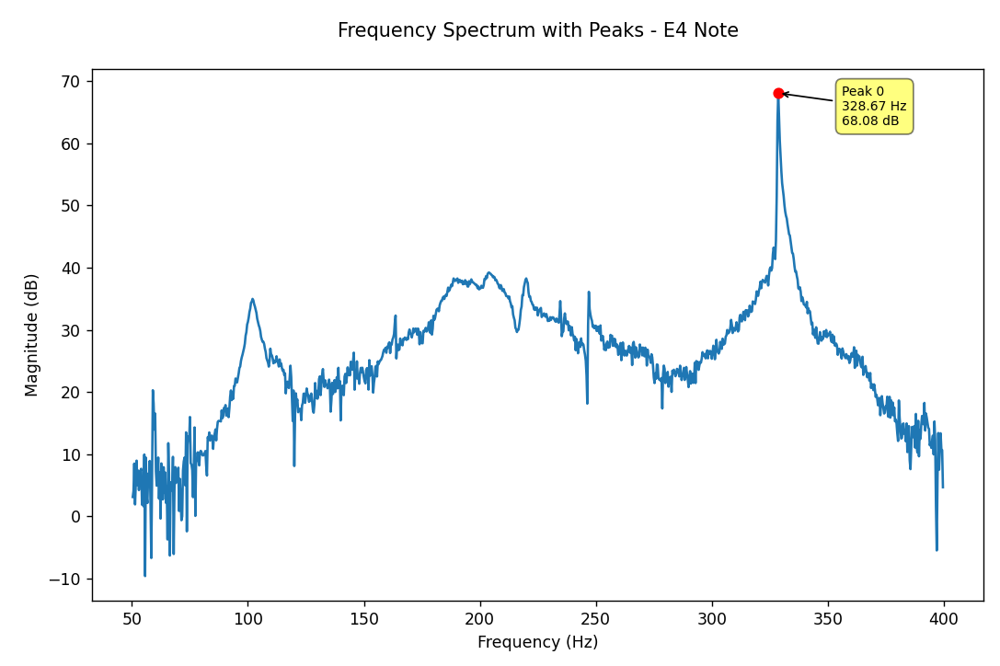
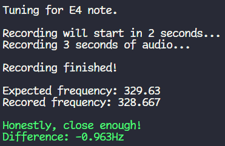
___


